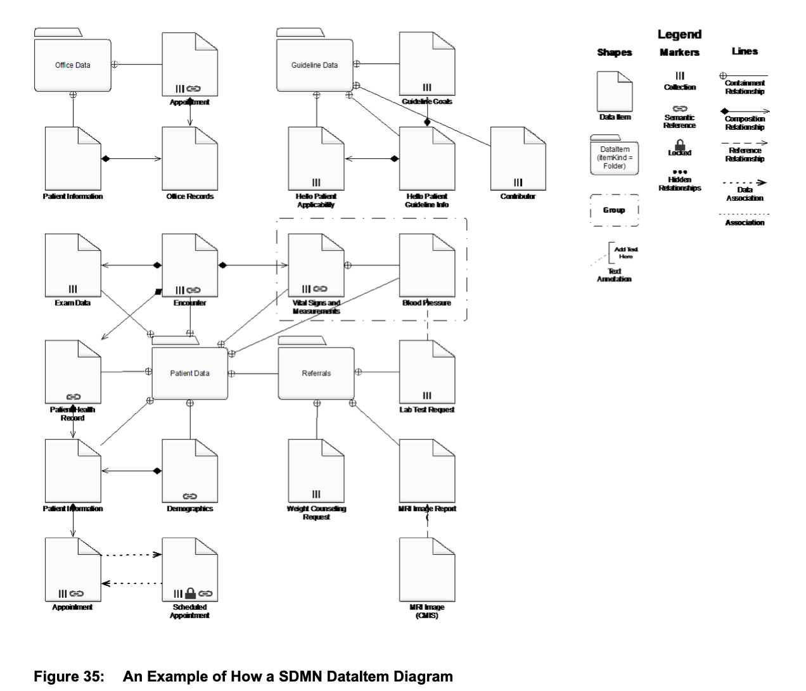
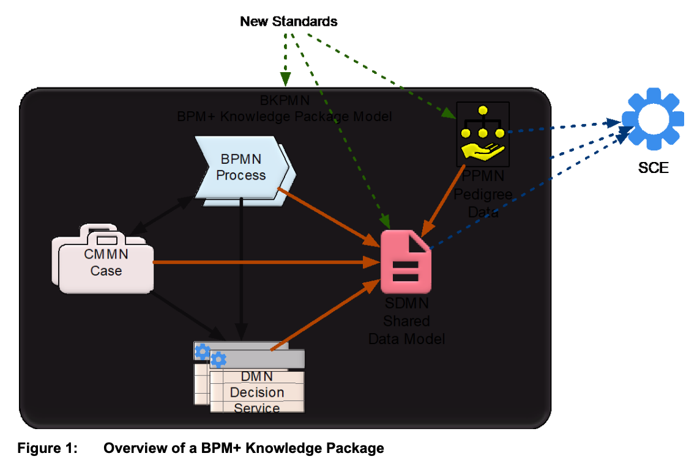
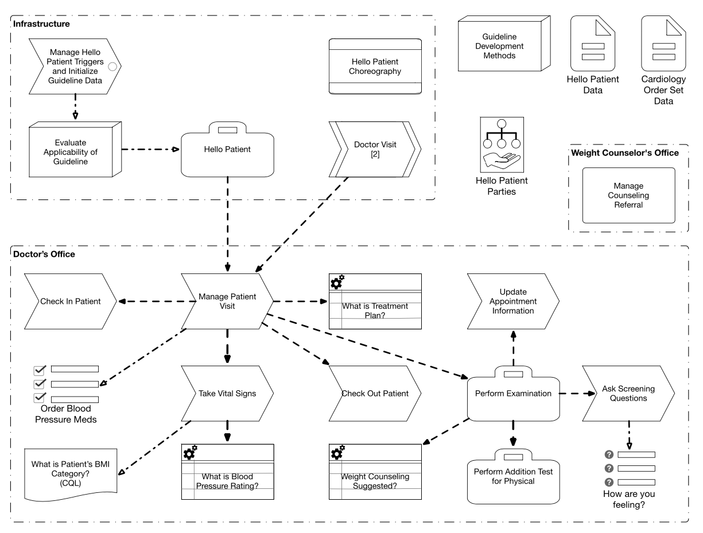

# Upcominds Standards at OMG

Main repo: https://github.com/omg-bpm-taskforces/omg-bpm-specs

The standards currently developed at OMG are:

* Specification Common Elements (SCE) - in beta
* Shared Data Model and Notation (SDMN) - in beta
* BPM+ Knowledge Package Model and Notation (BKPMN) - in beta
* Pedigree and Provenance Model and Notation (PPMN) - not published yet

---

## Specification Common Elements (SCE)

> SCE 1.0 is not an independent specification that is implemented by itself.

This standard is a base for the remaining ones.
It specifies shared parts, e.g. DI, relationships (reference, composition etc.), and some artifacts: Group, Text Annotation, Associations.

---

### SCEDI

The DI structure defined in SCE is nearly identical to the one defined in DMN 1.2.
The XML can contain multiple diagrams of which each is a container for diagram elements and style.
There is no concept of _plane_ which is present in BPMN 2.0.

---

### Some new properties

SCE defines `aliasId` and `humanId` as properties of the base element. Both are optional and don't have to be unique.

Also, the definitions can contain tag, version, and version date out of the box.

---

## Shared Data Model and Notation (SDMN)

SDMN allows to define data items to be reused in data items of other OMG standards.
The idea is that I can specify my data once and refer to it in BPMN, DMN, CMMN etc.

---

### Example

---

### Expression language

The default language for expressions and types of SDMN is FEEL.

---

### Data item

Data item is the central object in SDMN. It is used to represent the type of data.
Data items have several properties and can contain other data items (as folders).

---

### Connector

Connector is the term used in SDMN to represent relationships between data items, i.e.

* Composition
* Containment
* Reference
* Data Association

---

## BPM+ Knowledge Package Model and Notation (BKPMN)

This standard allows to wrap BPM+ (BPMN, DMN, CMMN...) diagrams in a single package.

---

### Example

---

### Structure

The diagram consists of elements which mostly represent diagrams of other standards.

---

### Manifest

Manifest is the part of the model which enumerates references to outside objects, e.g. BPMN diagrams.

---

## Discussion
